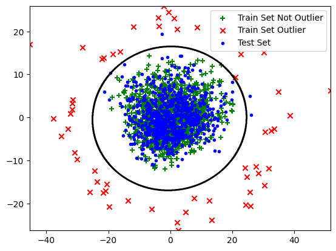
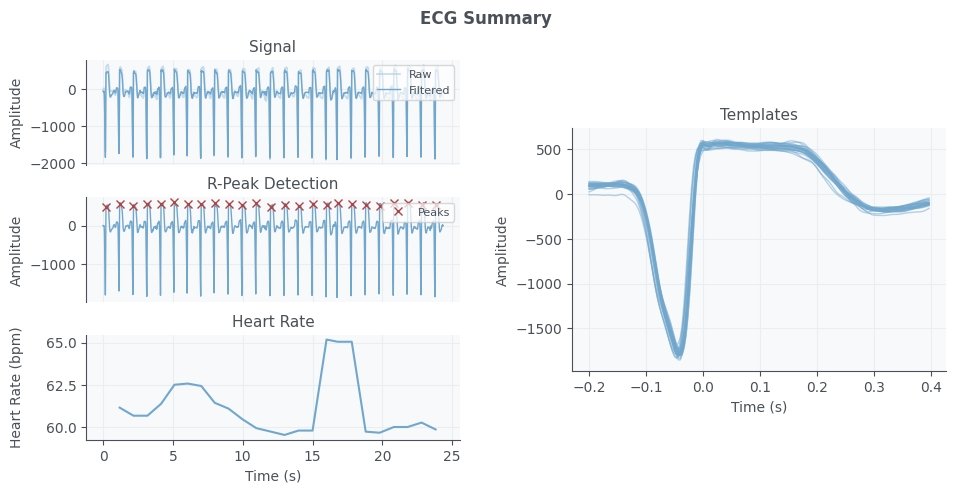
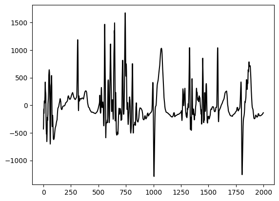

# Advanced Machine Learning Projects
These 3 projects, were part of the AS 2024 **Advanced Machine Learning** at ETH course, developed by my friend Sebastian and myself.

# Project 1 - Age Regression Based on MRI Brain Scans

### Overview
The goal was to predict age from MRI brain scans using various ML techniques. The focus was on data preprocessing, feature selection, and model ensembling to achieve optimal regression performance.

### Key Steps
### Data Preprocessing
- **Missing Values:** KNN imputation provided the best R² score.
- **Scaling Methods:** 
  - **Quantile Transformer** improved performance by normalizing data distribution.
  - **RobustScaler** enhanced results for SVR and Tree Regressors by reducing outlier impact.

### Outlier Detection
- Used **Elliptic Envelope (GMM with one component)** after PCA transformation to detect and remove outliers.

### Feature Selection
- **Correlation-based filtering:** Removed features with correlation < 0.2.
- **Multicollinearity reduction:** Eliminated highly correlated features.

## Models Used
- **Gaussian Process Regression (Best Model)**
  - Optimized kernel: **RationalQuadratic * Matern * DotProduct**.
  - Implemented with `gpytorch`.
- **Support Vector Regression (SVR)** optimized with RobustScaler.
- **Tree-Based Models:** LightGBM, ExtraTreeRegressor, XGBoost.

## Final Model and Submission
- **Ensemble Model** combining **Gaussian Process Regressor, SVR, and LightGBM** to reduce overfitting and improve performance.

<p align="center">
  
</p>

<p align="center"><em>Figure 1: Outlier Detection and Removal</em></p>

# Project 2 - ECG Classification

## Feature Extraction
The features were extracted using **Hearpy, Biosppy, and NeuroKit2** as suggested in the project presentation slides. After experimentation, we selected approximately **210 features**, including:
- **QRS interval features**
- **Heart Rate Variability (HRV) metrics**
- **Frequency-domain and time-domain features**
- **CSI, geometric properties, and Poincaré plot features**

### Preprocessing Steps:
- Applied a **baseline wander filter** to reduce noise.
- **Scaled** the signals appropriately.
- Removed irregularities such as **ectopic beats from RR intervals**.
- Processed signals using the **Biosppy ECG function**.
- Used **multi-threading** to compute features efficiently without overloading VRAM.

## Model Selection
Since many features contained **NaN values**, we considered models that either support NaN values or work well with imputation.

### Models Tested:
- **LGBM Classifier**
- **XGB Classifier**
- **Histogram Gradient Boosting Classifier** (Best Model)
- **Extra Trees Classifier**
- **Gaussian Process (GP) Classifier**
- **SVM Classifier**
- **Decision Tree Classifier**
- **One-vs-One Pairwise Classifiers** with a **Meta Classifier**

The best-performing model on the validation set and public leaderboard was the **Histogram Gradient Boosting Classifier**, which was chosen for the final submission.

<table align="center">
  <tr>
    <td align="center">
      <br>
      <em>Figure 2: ECG Onsets used as Features</em>
    </td>
    <td align="center">
      <br>
      <em>Figure 3: R Peaks and template beats</em>
    </td>
  </tr>
  <tr>
    <td align="center">
      <br>
    <em>Figure 4: QRS Complex</em>
    </td>
    <td align="center">
      <br>
      <em>Figure 5: PSD Periodigram</em>
    </td>
  </tr>
</table>

<table align="center">
  <tr>
    <td align="center">
      <br>
      <em>Figure 6: Original Signal</em>
    </td>
    <td align="center">
      <br>
      <em>Figure 7: Transformed Signal</em>
    </td>
  </tr>
</table>


# Project 3 - Robust Non-negative Matrix Factorisation (RNMF) Pipeline

## Overview
This repository contains our PyTorch implementation of Robust Non-negative Matrix Factorisation (RNMF) using Bregman iterations, inspired by Hannah Dröge's paper ([RNMF Paper](https://pmc.ncbi.nlm.nih.gov/articles/PMC8541511/)). The original implementation was in MATLAB, and we have reimplemented and optimized it for GPU acceleration, significantly improving processing speed.

Our pipeline integrates RNMF into a deep learning-based segmentation model by expanding on the idea of using instant segmentation methods on top of the factorized matrices as features for various deep learning architectures, thus enhancing feature extraction and representation learning.

## Data Pre-Processing
- Images were normalized using min-max scaling.
- Videos were categorized into amateur and expert datasets.
- Each dataset was split into training and validation sets (validation size: 20%).

## Pipeline Methodology
1. **Non-negative Matrix Factorisation (NMF)**: Initial decomposition using scikit-learn's NMF.
2. **RNMF with Bregman Iterations**: Further refinement to produce a sparse matrix **S**.
3. **WH Reconstruction**: Instead of using **S** directly, we utilized the WH reconstruction of the video, which yielded better results.
4. **Sparse Encoding**: The absolute deviation of WH from the original video was used as a sparse encoding, improving empirical results.
5. **Multi-Otsu Segmentation**: Applied to the RNMF-transformed representation to segment it into two classes using multi-Otsu instant segmentation.
6. **Channel Concatenation**: Constructed dataset with shape **Nx3xHxZ** (original image, RNMF-transformed image, and multi-Otsu segmented RNMF image).

## Data Engineering
- Implemented a PyTorch **Dataset** class with on-the-fly image transformations.
- Applied affine transformations and random elastic deformations dynamically during training.
- Ensured transformation consistency by concatenating image and mask along the channel dimension before applying transformations.

### Training Strategy
- **30 epochs** on the amateur dataset.
- **45 epochs** on the expert training set.
- **10 epochs** on the entire expert dataset.

This strategy allowed the model to generalize better, as pretraining on the amateur dataset provided a better initialization for expert data.

- Checkpoints were implemented to evaluate **mean IoU** on the validation set.
- Only the best-performing model at each checkpoint was saved.

## Model Architecture and Loss Function
### Architectures Evaluated:
- **SwinUNET**
- **TransUNET**
- **UNET**
- **DUCKNet**
- **UNET++**

Among these, **UNET++** achieved by far the highest performance.

### Loss Function:
- **IoU Loss**: Produced better object-level segmentation.
- **Binary Cross-Entropy (BCE) Loss**: Improved pixel-level precision.
- **Custom Loss (BinaryFocalIoU)**: A combination of focal binary cross-entropy loss and IoU loss for optimal performance.

## Submission & Post-processing
- **Threshold Optimization**: A threshold of **0.75** yielded the best results.
- **Batch-wise Predictions**: Test videos were processed as datasets and inferred batch-by-batch using a DataLoader.
- **Pickle File Storage**: Predictions for each video were saved in pickle format.
- **Dimensional Permutation**: Converted outputs to NumPy format.
- **Multiprocessing for Efficiency**: Utilized multiprocessing to accelerate computation while using batch processing to prevent VRAM overload.

## Installation & Usage
### Dependencies
- Python 3.x
- PyTorch
- scikit-learn
- NumPy
- OpenCV
- Joblib for Multiprocessing

### Running the Pipeline
```bash
# Install dependencies
pip install -r requirements.txt

# Train the model
python train_no_pipeline.py

# Visualize the outputs
python visualize.py
```

