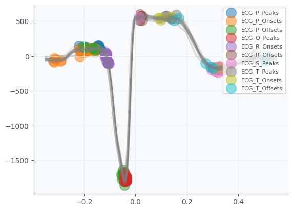
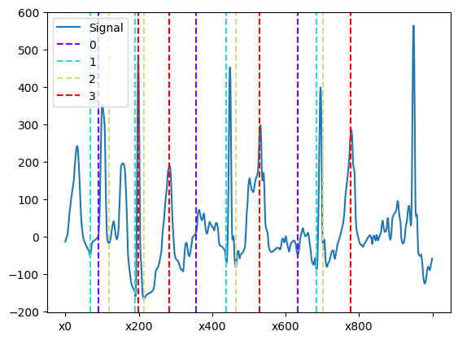

# Advanced Machine Learning Projects
These 3 projects, were part of the AS 2024 **Advanced Machine Learning** at ETH course, developed by my friend Sebastian and myself.

## Project 1 - Age Regression Based on MRI Brain Scans

### Overview
The goal was to predict age from MRI brain scans using various ML techniques. The focus was on data preprocessing, feature selection, and model ensembling to achieve optimal regression performance.

### Key Steps
### Data Preprocessing
- **Missing Values:** KNN imputation provided the best R² score.
- **Scaling Methods:** 
  - **Quantile Transformer** improved performance by normalizing data distribution.
  - **RobustScaler** enhanced results for SVR and Tree Regressors by reducing outlier impact.

### Outlier Detection
- Used **Elliptic Envelope (GMM with one component)** after PCA transformation to detect and remove outliers.

### Feature Selection
- **Correlation-based filtering:** Removed features with correlation < 0.2.
- **Multicollinearity reduction:** Eliminated highly correlated features.

## Models Used
- **Gaussian Process Regression (Best Model)**
  - Optimized kernel: **RationalQuadratic * Matern * DotProduct**.
  - Implemented with `gpytorch`.
- **Support Vector Regression (SVR)** optimized with RobustScaler.
- **Tree-Based Models:** LightGBM, ExtraTreeRegressor, XGBoost.

## Final Model and Submission
- **Ensemble Model** combining **Gaussian Process Regressor, SVR, and LightGBM** to reduce overfitting and improve performance.

  

<em>Figure 1: Outlier Detection and Removal</em>

# Project 2 - ECG Classification

## Feature Extraction
The features were extracted using **Hearpy, Biosppy, and NeuroKit2** as suggested in the project presentation slides. After experimentation, we selected approximately **210 features**, including:
- **QRS interval features**
- **Heart Rate Variability (HRV) metrics**
- **Frequency-domain and time-domain features**
- **CSI, geometric properties, and Poincaré plot features**

### Preprocessing Steps:
- Applied a **baseline wander filter** to reduce noise.
- **Scaled** the signals appropriately.
- Removed irregularities such as **ectopic beats from RR intervals**.
- Processed signals using the **Biosppy ECG function**.
- Used **multi-threading** to compute features efficiently without overloading VRAM.

## Model Selection
Since many features contained **NaN values**, we considered models that either support NaN values or work well with imputation.

### Models Tested:
- **LGBM Classifier**
- **XGB Classifier**
- **Histogram Gradient Boosting Classifier** (Best Model)
- **Extra Trees Classifier**
- **Gaussian Process (GP) Classifier**
- **SVM Classifier**
- **Decision Tree Classifier**
- **One-vs-One Pairwise Classifiers** with a **Meta Classifier**

The best-performing model on the validation set and public leaderboard was the **Histogram Gradient Boosting Classifier**, which was chosen for the final submission.

<table align="center">
  <tr>
    <td align="center">
       
      <em>Figure 2: ECG Onsets used as Features</em>
    </td>
    <td align="center">
       
      <em>Figure 3: R Peaks and template beats</em>
    </td>
  </tr>
  <tr>
    <td align="center">
       
    <em>Figure 4: QRS Complex</em>
    </td>
    <td align="center">
       
      <em>Figure 5: PSD Periodigram</em>
    </td>
  </tr>
</table>

